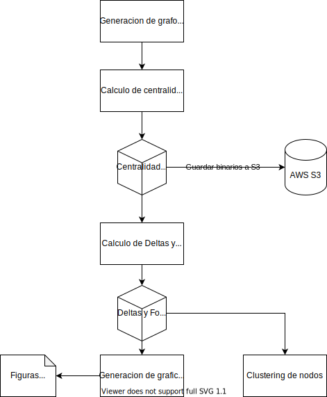

# Human Metabolic Network

**Scope:** This proyect aims to bla bla bla

## Estructura de este proyecto

### Carpetas

- **source** incluye todos los archivos ejecutables, y codigos a utilizar en el proyecto. Eg. `.py`, `.r`, `.rmd`. Incluye ademas `runtime.sh`, con las instrucciones _SBATCH_ para ejecución en el cluster. 
- **data** incluye todos los modelos `.json` y tablas con valores de metabolitos y reacciones para los analisis. 
- **results** incluye todos los modelos de redes `.gephx` para analisis, tablas `.tsv`, y objetos `.pickle` y `.rds` intermedios. 
- **doc** incluye los `.md` (y posiblemente) `.rmd` usados para la publicación. 
    - **img** incluye las figuras generadas. `.png`, `.svg` o demás, que se incluyan en la publicación. 

El proyecto no es aun publico, por lo que no se incluye una documentación aparte de los `README.md` y _docstrings_ presentes en el código. Eventualmente incluir una documentación via Github Pages. 

### Flow del proyecto

### .gitignore

Los achivos marcados como `tmp.*` son excluidos, en base a que sean archivos borrador. 
Incluye omisión de proyectos de RStudio (`.RData`. `.Rhistory`, ...); y finalmente archivos de claves `.pem` como precaución. 

-----

## References

De Martino, Daniele, Anna MC Andersson, Tobias Bergmiller, Călin C. Guet, y Gašper Tkačik. 2018. «Statistical Mechanics for Metabolic Networks during Steady State Growth». *Nature Communications* 9 (1): 2988. https://doi.org/10.1038/s41467-018-05417-9.

